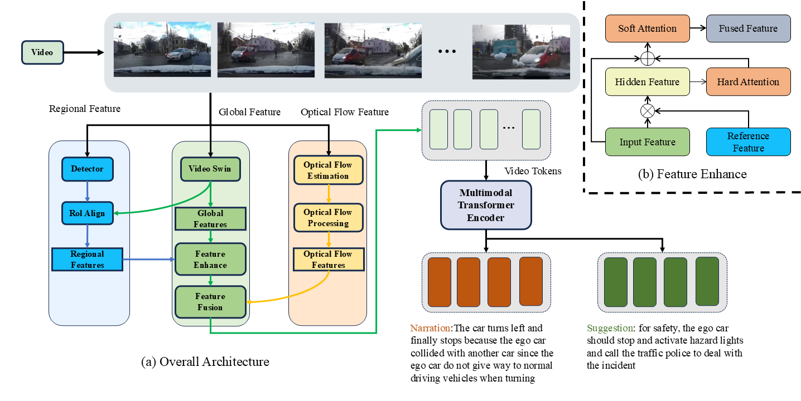

# IAAD

  

This repository is an official implementation of IAAD

Created by yufan shu

## Introduction

We propose an end-to-end transformer-based architecture, we propose An abnormal behavior dataset, and the driving behavior understanding and retrieval of video data are realized

This repository contains the training and testing of the proposed framework in paper.

## Note
This reposity will be updated soon, including:
- [] Uploading the **[Preprocessed Data](#dataset-preparation)** of dataset.
- [x] Uploading the **Raw Data** of IAAD.
- [] Uploading the **Visualization Codes** of raw data and results.
- [x] Updating the **Experiment Codes** to make it easier to get up with.
- [x] Uploading the **[Conda Environments](#1-installation-as-conda)** of ASU-AD.


## Getting Started


### 1. Installation as Conda

Create conda environment:
```
conda create --name asuad python=3.8
conda activate asuad
```

install torch
```
pip install torch==1.13.1+cu116 torchaudio==0.13.1+cu116 torchvision==0.14.1+cu116 -f https://download.pytorch.org/whl/torch_stable.html
```

install apex
```
git clone https://github.com/NVIDIA/apex
cd apex
pip install -r requirements.txt
pip install -v --disable-pip-version-check --no-cache-dir --no-build-isolation --config-settings "--build-option=--cpp_ext" --config-settings "--build-option=--cuda_ext" ./
(I highly recommend going to the apex repository in person to see if the install commands are updated, I've been bothered by this issue)
cd ..
rm -rf apex
```


install yolov5
```
git clone https://github.com/ultralytics/yolov5
cd yolov5
pip install -r requirements.txt
```

install requirements
```
apt-get install mpich
sudo apt-get update
sudo apt-get install libopenmpi-dev
pip install mpi4py
pip install -r requirements.txt
```

## Dataset Preparation

You can ether download the preprocessed data in [this site](https://www.alipan.com/s/PYmo89r86RJ), or just download the raw videos and car information in [this site](https://pan.baidu.com/s/1do8NaAx_09UD2SVUL6LC4g?pwd=5aki), and preprocess it with the code in `src/prepro`.
```
sh src/prepro pre.sh
sh src/prepro test.sh
sh src/prepro ttt.sh
```


## Models

* We release our best performing checkpoints. You can download these models at [ [Baidu](https://pan.baidu.com/s/1Wp5ZxWImj5kQh8dO-vrdbw?pwd=ip9m 
) ] and place them under `checkpoints` directory. If the directory does not exist, you can create one.

* You' also need to download the pre-trained multimodal bert and Video Swin Transformer models.You can download these models at [ [Baidu](https://pan.baidu.com/s/1FwLrgyDUp_xN3vquFutqhg?pwd=uixf
) ] 

## Training
```bash
sh scripts/train.sh
```


## Evaluate turn accuracy
```python
python turn_acc.py
```


## Acknowledgments

Our code is built on top of open-source GitHub repositories. 
We thank all the authors who made their code public, which tremendously accelerates our project progress. 
If you find these works helpful, please consider citing them as well.

[jxbbb/ADAPT](https://github.com/jxbbb/ADAPT)

[Microsoft/SwinBERT](https://github.com/microsoft/SwinBERT) 

[JinkyuKimUCB/BDD-X-dataset](https://github.com/JinkyuKimUCB/BDD-X-dataset)

[huggingface/transformers](https://github.com/huggingface/transformers) 

[Microsoft/DeepSpeed](https://github.com/microsoft/DeepSpeed)

[Nvidia/Apex](https://github.com/NVIDIA/apex)

[FAIR/FairScale](https://github.com/facebookresearch/fairscale)

